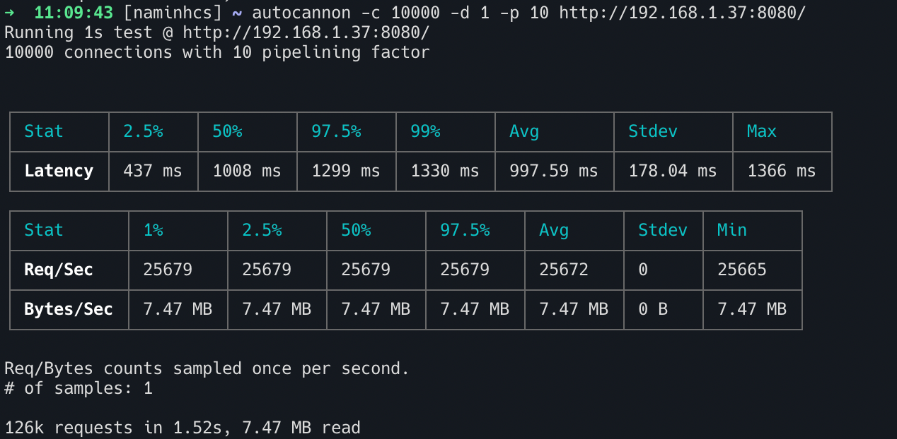

# HTTP/1.1 Server Using C++

## Content

- [Content](#Content)
- [Solution](#Solution)
- [Requirements](#Requirements)
- [Quick-start](#quick-start)
- [Testing tool](#testing-toll)
- [References](#references)

## Requirements
- [x] Run on Linux.
- [x] Do not use any third party networking library, i.e. use only Linux system API.
- [x] Handle at least 10,000 concurrent connections.
- [~] Serve at least 100,000 requests per second on a modern personal computer (I can handle 126k/1.52s)
- [x] Serve a simple one or two pages website for demonstration.

## Solution
- The first solution:
    - It's the simple solution, I use a socket to connect with Browser and handle the request from it. This solution handle one by one request and just only a concurrent connection.
- The second solution: 
    - How can i handle multiple cooncurrent connections. And my soultion is using multi-thread. Each request, i create new thread and that thread will handle that request. When the socket close, i join that thread with main thread. This solution takes us many hareware of computer and take many time when create new thread.
- The third solution:
    - How can i know with thread done and assign new request to this. I'm using ThreadPool. But this solution takes a time to waiting a new request come and does't know when a socket close (disconnect with a user).
- The final solution:
    - How can i know when request coming and when socket close. I'm using Epoll. Each socket in linux is file descriptor, and epoll will notify for me when this file changes, it means the request coming or a socket close

- Summary: In this project, i'm using ThreadPool and epoll. When request is coming, epoll can notify and i handle that request with threadpool.

## Introduction
Two basic url:
1. GET /
2. GET /show-image.
## Quick-start

```
git clone https://github.com/naminhcs/HTTP-CPP.git
bash run.sh
```
After run this command, server will run on port 8080.

## Testing tool
I use [autocannon](https://github.com/mcollina/autocannon?ref=thechiefio) to testing concurrent connection and request/s

```
autocannon -c 10000 -d 1 -p 10 http://192.168.1.37:8080/
```
To testing run this command, it means 10000 concurrent connections and each connection sends 10 request.


## References
1. [ThreadPool](https://github.com/progschj/ThreadPool)
2. [epoll](https://github.com/hnakamur/luajit-examples)

